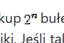

# szkopul-solver


This Python script automates the process of solving problems from [Szkopuł](https://szkopul.edu.pl)

```bash
git clone https://github.com/Kamix-08/szkopul-solver
cd szkopul-solver
```

## Features

- **Task scraping**: automatically extracts task details from Szkopuł
- **AI integration**: utilizes [Groq](https://groq.com) to process and solve tasks
- **Code submission**: formats the solutions into a `.cpp` file and submits them back to Szkopuł

## Prerequisites

Before executing the script, install the dependencies, by running

```bash
pip install -r requirements.txt
```

The dependencies include:

- `groq>=0.9.0`
- `bs4>=0.0.2`
- `requests>=2.31.0`
- `PyPDF2>=3.0.1`

## Configuration

Modify the `config.json` file to include your credentials and configuration:

```json
{
    "GROQ_API_KEY": "foo",
    "SZKOPUL_API_KEY": "bar",
    "AI_MODEL": "baz"
}
```

### API Tokens

All of the necessary API Tokens are free.

Groq: <br> https://console.groq.com/keys

Szkopul: <br> https://szkopul.edu.pl/api/token

### Configuration

You can find aviable AI models here: <br> https://console.groq.com/docs/models

In the `config.json` file, set the value of `AI_MODEL` to the `Model ID` of AI of you choosing.

_Example:_

```json
"AI_MODEL": "llama3-8b-8192"
```

## Problems

Szkopul uses images to render some of the text, such as `2^n` in this example:



The script cannot process those images, so the user will be prompted to input the text from those images manually:

```plaintext
[?] Input the text seen on the LaTeX image #1: 
```

On top of that, the script can only process problems from public contest, such as [zLO155](https://szkopul.edu.pl/c/zlo155/), while not being able to process private contests (contest, that require authorization to access), such as [PIWO 2019/20](https://szkopul.edu.pl/c/piwo-201920/).

## Contributions

Contributions are welcome! If you'd like to contribute, please fork the repository and use a feature branch. Pull requests are warmly welcome.

## License 

This project is licensed under the MIT License - see the [`LICENSE`](./LICENSE) file for details.